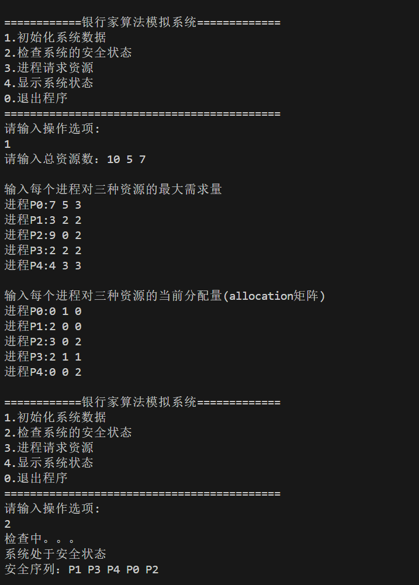
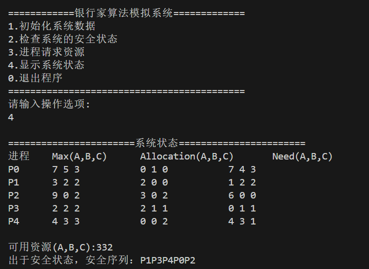
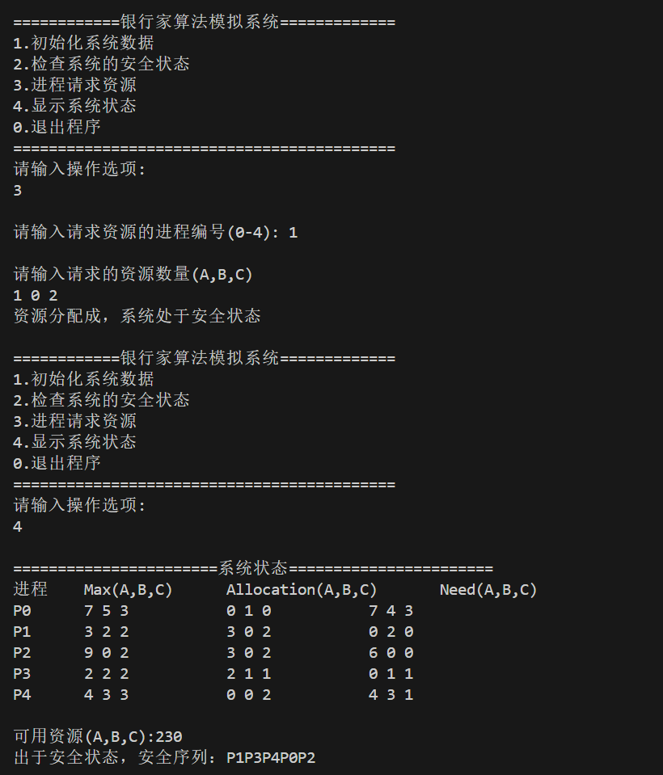
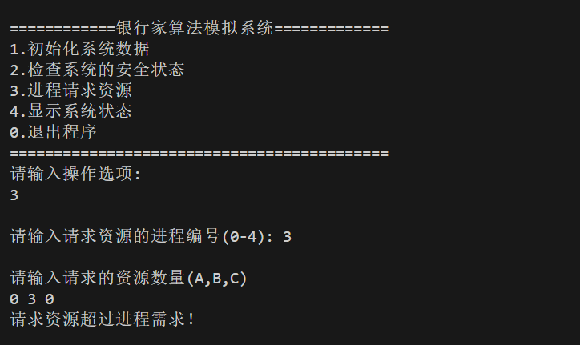
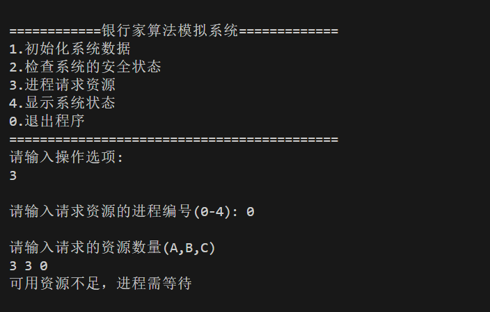
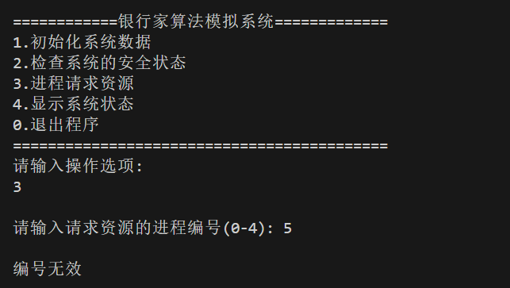
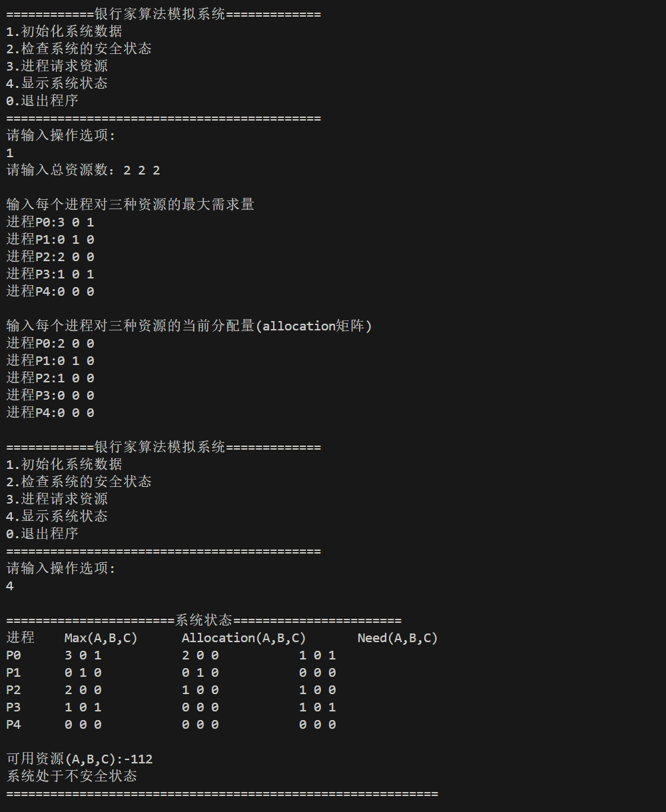

**操作系统实验三 银行家算法仿真实现**

**一、实验目的**
- 学习编程工具和算法使用，掌握死锁的概念和消除方法。

**二、实验内容**
- 编写一程序能够模拟银行家算法和安全算法來避免死锁。
- 假设系统资源有ABC三种，可以运行5个进程。
- 该程序具备的基本功能为：
- 程序可以输入3种资源的数目，5个进程对3种资源的最大需求量，已分配量和需求量。 能够判断某一吋刻系统是否处于安全状态，如果处于安全状态能够，给出安全序列，当某进程提岀资源申请时，能够判断是否能把资源分配给申请进程。
- 程序应当具有简单的交互能力，功能完整。

**三、实验要求**
- 【提示】定义：总的资源向量、最大需求矩阵、已分配矩阵、请求矩阵、当前可用资源、判断安全时动态可用资源的向量、可完成标志向量等数据结构，然后在此基础上设计实现银行家算法，即判断如果进行某种分配，是否安全的算法。下面的PPT和数据示例供同学们参考。数据示例可用于程序调试。

**四、实验代码与原理**
见`banker_algorithm.c`

- 银行家算法原理：
    - 银行家算法是一种预防性的资源分配策略，用于避免操作系统中的死锁。
    - 它通过模拟银行家在贷款时的谨慎行为来确保系统不会进入不安全状态，从而防止死锁的发生。
    - 银行家算法的基本思想是：在分配资源之前，先判断系统是否处于安全状态。如果是安全状态，则分配资源；否则，拒绝分配。

**五、关键函数、参数与逻辑**
1. `initialize()`
    - 功能：初始化系统资源、进程的最大需求、已分配资源和需求矩阵。
    - 参数：无
    - 返回值：无
2. `isSafe()`
    - 功能：通过检查每个资源的需求量是否均小于或等于工作向量，检查系统是否处于安全状态
    - 参数：`安全矩阵safe_sequence[]`
    - 返回值：布尔值，表示系统是否处于安全状态
3. `requestResources()`
    - 功能：资源请求处理，为进程分配资源，检查资源分配异常问题
    - 参数：无
    - 返回值：无

4. `displayStatus()`
    - 功能：打印显示当前的系统状态，包括输出进程相关信息，可用资源量，安全状态和不安全状态提示和安全序列
    - 参数：无
    - 返回值：无

5. `menu()`
    - 功能：调用函数，通过操作数调用上述不同功能
    - 参数：无
    - 返回值：无

6. `main()`
    - 功能：程序主入口
    - 参数：无
    - 返回值：整型，程序执行状态

**六、测试用例**
1. 输入数据(用于测试1-6)
- 操作数: 1：
- 总资源数：10 5 7 (A:10, B:5, C:7)
- Max矩阵：
    - P0: 7 5 3 
    - P1: 3 2 2
    - P2: 9 0 2
    - P3: 2 2 2
    - P4: 4 3 3
- Allocation矩阵：
    - P0: 0 1 0
    - P1: 2 0 0
    - P2: 3 0 2
    - P3: 2 1 1
    - P4: 0 0 2

2. 基础安全状态验证

预期结果(操作数4)：

3. 资源分配
- 操作数: 3
- 进程号: 1
- 请求资源: 1 0 2

预期结果(操作数4)：

4. 资源请求超过need
- 操作数: 3
- 进程号: 2
- 请求资源: 7 0 0

预期结果(操作数4):

5. 资源请求超过可用资源
- 操作数: 3
- 进程号: 3
- 请求资源: 0 3 0

预期结果(操作数4):

6. 无效进程编码
- 操作数: 3
- 进程号: 5
- 请求资源: 0 2 0

预期结果(操作数4):

7. 初始状态不安全
- 输入
- 操作数: 1

