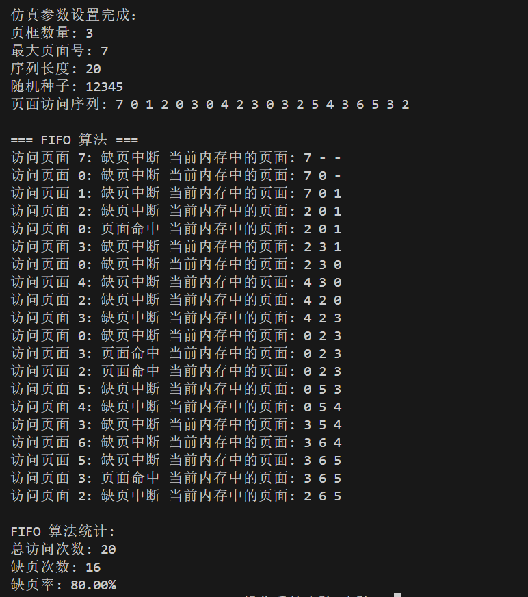
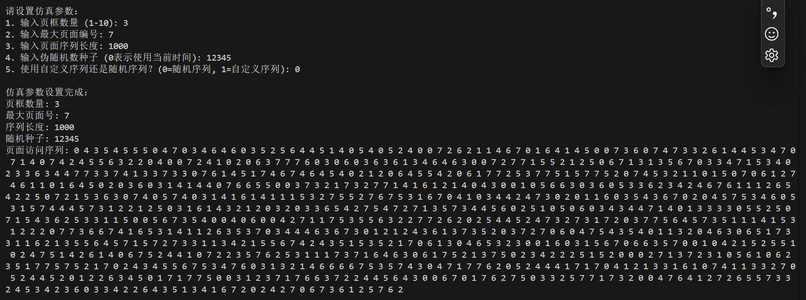
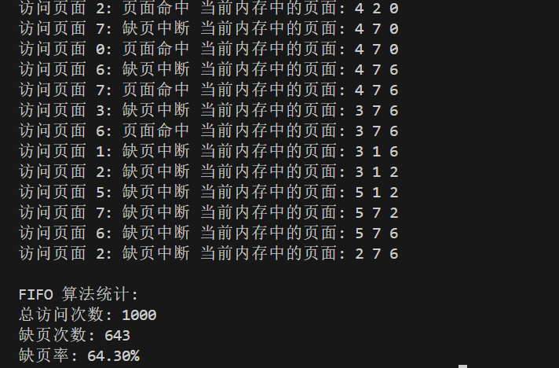
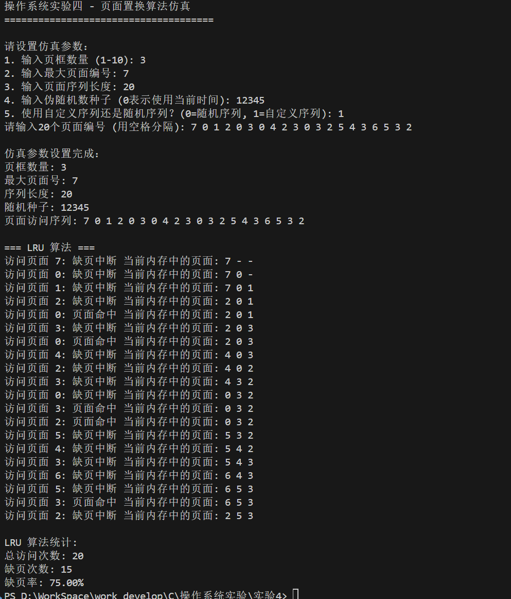
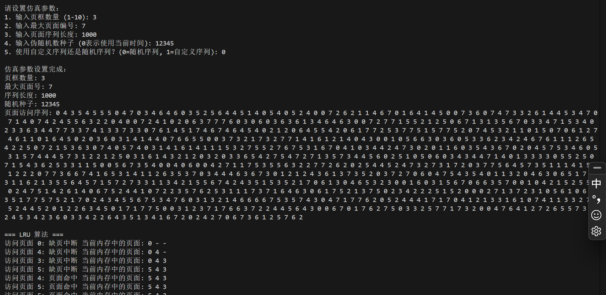
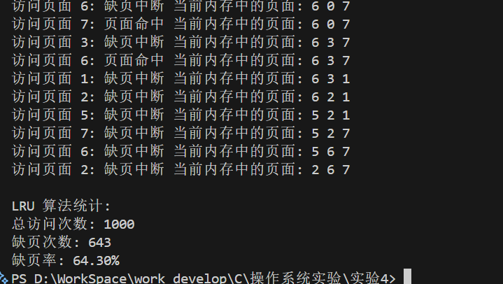

# 操作系统实验四 - 页面置换算法仿真

## 实验目的
1. 加深对虚拟内存管理理论的理解
2. 学习页面置换的实现机制及页面置换算法的实现

## 实验内容
1. 设计进行页面置换管理的数据结构
2. 实现FIFO, LRU等页面置换算法，支持固定分配局部置换策略的实现
3. 程序可以指定进程所分配的页框数量，可以仿真随机产生页面访问序列（rand），页面访问序列的最大页面编号可指定，伪随机数种子可设定（srand()），页面序列长度可设定
4. 完成特定测试用例和随机序列测试

## 数据结构设计

### Page 结构体
用于表示页面信息：
- `page_number`: 页面编号
- `last_used`: 最近使用时间（用于LRU算法）

### Frame 结构体
用于表示页框信息：
- `page_number`: 当前页框中的页面编号
- `valid`: 有效位，表示页框是否被占用
- `loaded_time`: 装入时间（用于FIFO和LRU算法）

### SystemState 结构体
用于表示整个系统的状态：
- `frames`: 页框数组
- `frame_count`: 页框数量
- `page_faults`: 缺页次数
- `total_accesses`: 总访问次数

### 初始化系统状态

在开始仿真之前，需要初始化系统状态`init_system`，包括：
- 页框数组的初始化，将所有页框的有效位设为0
- 页框数量的初始化，根据用户输入的参数设置
- 缺页次数和总访问次数的初始化，设为0

### 生成随机页面访问序列

在仿真过程中，需要根据用户输入的参数生成随机页面访问序列`generate_random_sequence`，包括：
- 最大页面编号的初始化，根据用户输入的参数设置
- 页面序列长度的初始化，根据用户输入的参数设置
- 伪随机数种子的初始化，根据用户输入的参数设置
- 随机数生成，根据最大页面编号和页面序列长度生成随机页面访问序列

## 算法实现

### FIFO（先进先出）算法`fifo_replacement`
1. 当访问一个页面时，首先检查它是否已经在内存中
2. 如果页面不在内存中，则发生缺页中断
3. 如果有空闲页框，则直接装入页面
4. 如果没有空闲页框，则选择最早装入的页面进行置换

### LRU（最近最少使用）算法`lru_replacement`
1. 当访问一个页面时，首先检查它是否已经在内存中
2. 如果页面在内存中，则更新其最近使用时间
3. 如果页面不在内存中，则发生缺页中断
4. 如果有空闲页框，则直接装入页面并记录使用时间
5. 如果没有空闲页框，则选择最久未使用的页面进行置换

## 实验结果

### 测试用例
程序会分别运行以下测试：
1. 输入测试用例参数: 
2. 页框数量：3
3. 最大页面编号：7
4. 页面序列长度：20
- 使用给定的特定序列（7 0 1 2 0 3 0 4 2 3 0 3 2 5 4 3 6 5 3 2）进行FIFO和LRU算法测试（自定义序列 1）
- 生成1000个页面访问的随机序列进行FIFO和LRU算法测试（随机序列 0）
5. 伪随机数种子：0（使用当前时间）/12345（固定种子，结果可重复）本次采用：12345
6. 序列类型：1（自定义序列）/0（随机序列）

### 测试预期结果
对于每种测试，程序都会输出：
- 每次页面访问时的内存状态
- 总访问次数
- 缺页次数
- 缺页率

### 测试结果截图
#### FIFO算法测试结果：
1. 自定义序列：

2. 随机序列：



#### LRU算法测试结果：
1. 自定义序列：

2. 随机序列：



## 如何编译和运行

### 编译
在命令行中执行以下命令：
```bash
make
```

或者直接使用gcc编译：
```bash
gcc -Wall -Wextra -std=c99 -o page_replacement page_replacement.c
```

### 运行
```bash
./page_replacement.exe
```